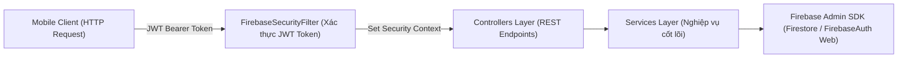
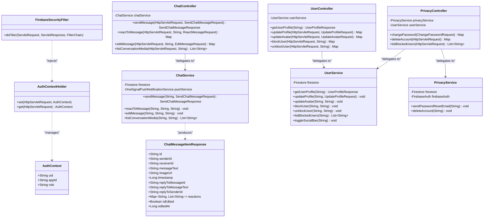
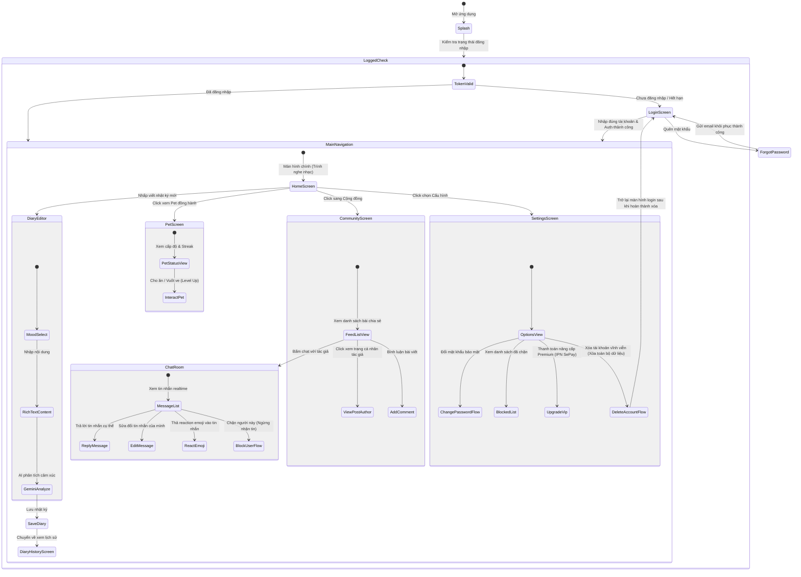

# BÁO CÁO CHI TIẾT CUỐI KỲ MÔN HỌC - DỰ ÁN SOULMATE

---

## 1. SƠ ĐỒ CƠ SỞ DỮ LIỆU (FIRESTORE DATABASE SCHEMA)

Do hệ thống SoulMate lưu trữ đám mây qua **Google Cloud Firestore (NoSQL)**, dữ liệu được thiết kế theo dạng các **Collections** (Bộ sưu tập) và **Documents** (Tài liệu) với cấu trúc trường linh hoạt nhưng chặt chẽ, tối ưu hóa truy vấn realtime.

### 1.1. Collection: `users`
Lưu trữ thông tin hồ sơ người dùng, các thiết lập mạng xã hội và trạng thái tài khoản.

| Trường dữ liệu | Kiểu dữ liệu | Mô tả |
| :--- | :--- | :--- |
| `userId` (Document ID) | `String` | Uid duy nhất được cấp từ Firebase Authentication |
| `anonymousName` | `String` | Bí danh hiển thị công khai trên Community và Chat |
| `avatarUrl` | `String` | URL hình ảnh đại diện của người dùng |
| `bio` | `String` | Phần tự giới thiệu bản thân |
| `socialLinks` | `Array<Map>` | Danh sách liên kết MXH: `[{ "platform": "facebook", "url": "..." }]` |
| `blockedUsers` | `Array<String>`| Danh sách Uid các người dùng mà tài khoản này đã chặn |
| `isSocialBanned` | `Boolean` | Trạng thái cấm các hoạt động mạng xã hội (tương tác post, bình luận, chat) |
| `role` | `String` | Phân quyền truy cập: `user` hoặc `admin` |
| `premiumUntil` | `Long` | Thời gian hết hạn tài khoản Premium (Unix timestamp) |
| `createdAt` | `Long` | Thời điểm khởi tạo tài khoản |

### 1.2. Collection: `diaries`
Lưu trữ nhật ký cá nhân và phân tích cảm xúc của người dùng.

| Trường dữ liệu | Kiểu dữ liệu | Mô tả |
| :--- | :--- | :--- |
| `diaryId` (Document ID) | `String` | ID nhật ký tự sinh ngẫu nhiên |
| `user_id` | `String` | Uid của người viết nhật ký |
| `title` | `String` | Tiêu đề bài viết nhật ký |
| `text` | `String` | Nội dung văn bản chi tiết |
| `mood_tag` | `String` | Nhãn cảm xúc đã chọn hoặc được Gemini gợi ý (Happy, Sad, Calm, etc.) |
| `image_urls` | `Array<String>`| Các đường liên kết tải ảnh đính kèm nhật ký |
| `timestamp` | `Timestamp` | Thời gian tạo nhật ký (được đồng bộ Firestore) |
| `updated_at` | `Long` | Thời gian chỉnh sửa cuối cùng |

### 1.3. Collection: `community_posts`
Lưu trữ bài đăng chia sẻ ẩn danh tại cộng đồng SoulMate.

| Trường dữ liệu | Kiểu dữ liệu | Mô tả |
| :--- | :--- | :--- |
| `postId` (Document ID) | `String` | ID bài đăng cộng đồng |
| `userId` | `String` | Uid của tác giả bài viết |
| `title` | `String` | Tiêu đề chia sẻ |
| `text` | `String` | Nội dung chia sẻ |
| `imageUrl` | `String` | Đường dẫn ảnh đính kèm (nếu có) |
| `likes` | `Array<String>`| Danh sách Uid của những người dùng đã thích bài đăng |
| `comments` | `Array<Map>` | Danh sách bình luận: `[{ "id": "...", "userId": "...", "text": "...", "createdAt": 123 }]` |
| `isReported` | `Boolean` | Trạng thái báo cáo vi phạm nội dung |
| `reportedBy` | `Array<String>`| Danh sách Uid những người báo cáo bài viết |
| `createdAt` | `Long` | Thời điểm đăng bài |

### 1.4. Collection: `chats`
Lưu trữ các tin nhắn realtime trong hệ thống hộp thư riêng.

| Trường dữ liệu | Kiểu dữ liệu | Mô tả |
| :--- | :--- | :--- |
| `id` (Document ID) | `String` | ID tin nhắn duy nhất |
| `conversationId` | `String` | ID cuộc hội thoại (định dạng ghép cặp Uid: `uidMin_uidMax`) |
| `senderId` | `String` | Uid của người gửi |
| `receiverId` | `String` | Uid của người nhận |
| `messageText` | `String` | Nội dung văn bản của tin nhắn |
| `imageUrl` | `String` | URL ảnh gửi kèm (nếu có) |
| `timestamp` | `Long` | Thời điểm gửi tin nhắn |
| `isRead` | `Boolean` | Trạng thái đã đọc tin|
| `replyToMessageId` | `String` | ID tin nhắn gốc được phản hồi (Reply Context) |
| `replyToMessageText` | `String` | Preview văn bản tin nhắn gốc được phản hồi |
| `replyToSenderId` | `String` | Uid người gửi tin nhắn gốc được phản hồi |
| `reactions` | `Map<String, List>`| Bảng phản ứng emoji: `{"❤️": ["uid1", "uid2"], "👍": ["uid3"]}` |
| `isEdited` | `Boolean` | Trạng thái tin nhắn đã chỉnh sửa |
| `editedAt` | `Long` | Thời gian chỉnh sửa tin nhắn |

### 1.5. Collection: `pets`
Lưu trữ thông tin thú cưng đồng hành của người dùng.

| Trường dữ liệu | Kiểu dữ liệu | Mô tả |
| :--- | :--- | :--- |
| `petId` (Document ID) | `String` | ID của pet (trùng với Uid người sở hữu) |
| `name` | `String` | Tên đặt cho thú cưng |
| `level` | `Integer` | Cấp độ hiện tại của thú cưng |
| `exp` | `Integer` | Điểm kinh nghiệm tích lũy |
| `streak` | `Integer` | Chuỗi ngày liên tục viết nhật ký để nuôi thú cưng |
| `lastActive` | `Long` | Thời điểm tương tác cuối cùng |

---

## 2. THIẾT KẾ CÁC LỚP VÀ KIẾN TRÚC HỆ THỐNG

Dự án SoulMate tuân thủ triệt để mô hình phát triển hiện đại hướng module, tách biệt giao diện hiển thị và logic cơ sở dữ liệu.

### 2.1. Kiến Trúc Phía Mobile Client (Kotlin, Jetpack Compose)
Mobile Client được xây dựng theo **Clean Architecture** kết hợp mô hình **MVVM (Model-View-ViewModel)**.

```mermaid
graph TD
    subgraph Presentation ["1. Tầng Presentation (UI & View)"]
        View["Compose Screens (Home, Chat, Diary, Pet)"]
        VM["ViewModels (Quản lý State & Flow)"]
    end

    subgraph Domain ["2. Tầng Domain (Logic Nghiệp Vụ)"]
        UseCase["Use Cases / Interactors"]
        Model["Repository Interfaces / Entities"]
    end

    subgraph Data ["3. Tầng Data (Truy xuất Dữ Liệu)"]
        RepoImpl["Repositories Implementations"]
        RemoteDS["Remote DataSource (Retrofit, Firebase Firestore SDK)"]
        LocalDS["Local DataSource (Preferences Datastore)"]
    end

    View --> VM
    VM --> UseCase
    UseCase --> Model
    RepoImpl ..|> Model
    RepoImpl --> RemoteDS
    RepoImpl --> LocalDS
```

- **Tầng Presentation**: Sử dụng Jetpack Compose viết giao diện mang tính chất khai báo (declarative UI). State được nắm giữ trong ViewModels kế thừa lifecycle của Android, đảm bảo dữ liệu không bị reload khi xoay màn hình.
- **Tầng Domain**: Chứa các thực thể và quy chuẩn UseCase riêng biệt (ví dụ: `GetDiaryUseCase`, `NutrientPetUseCase`). Đây là lõi nghiệp vụ độc lập hoàn toàn với framework và thư viện ngoài.
- **Tầng Data**: Nơi hiện thực các Repository giao tiếp với hệ thống bên ngoài (API Spring Boot và Firestore SDK).

### 2.2. Kiến Trúc Phía Backend Server (Spring Boot, Java 17)
Phía Backend được thiết kế theo **Kiến trúc phân tầng chuẩn (Layered Architecture)** gồm 3 tầng nghiệp vụ chính:



1. **Security Filter (Tầng bảo mật tiên quyết)**: `FirebaseSecurityFilter` chặn và phân tích Header `Authorization`. Sử dụng Firebase Admin SDK xác thực token, sau đó lưu trữ định dạng context (`AuthContext`) gồm Uid và Role vào bộ lưu trữ thread riêng (`AuthContextHolder`) để ủy quyền phân quyền.
2. **Controller Layer**: Tiếp nhận HTTP requests, kiểm tra hợp lệ của DTO (Data Transfer Objects) đầu vào, định nghĩa cấu trúc RESTful API và điều hành phản hồi JSON về Client.
3. **Service Layer**: Trực tiếp xử lý logic nghiệp vụ của dự án: tạo tin nhắn đi kèm context phản hồi, quản lý danh sách block, kích hoạt webhook nâng cấp VIP, và xóa hàng loạt tài khoản an toàn thông qua tính chất Batch Transaction của Firestore.

---

## 3. SƠ ĐỒ LỚP (CLASS DIAGRAM) - PHÂN HỆ BACKEND CỐT LÕI

Sơ đồ lớp dưới đây thể hiện sự liên kết giữa các Controller, Service, DTO và các lớp cấu hình Firebase Admin cho các phân hệ nghiệp vụ vừa được hoàn thiện.



---

## 4. SƠ ĐỒ LUỒNG CHUYỂN MÀN HÌNH (SCREEN FLOW DIAGRAM)

Luồng tương tác ứng dụng của người dùng được mô tả trực quan từ giai đoạn đăng nhập tự động, tùy chỉnh thiết lập, viết nhật ký, tương tác cộng đồng cho tới nuôi dưỡng thú cưng.



---

### Kết luận
Hồ sơ báo cáo trên bao quát tường cận cấu trúc cơ sở dữ liệu phi quan hệ Firestore, phân tích rành mạch kiến trúc phân tầng đa nhiệm giữa Mobile Client và Backend Server, minh họa rõ nét các kết nối lớp thông qua UML Class Diagram, và phác thảo trực quan sơ đồ chuyển trạng thái màn hình thực tế trong ứng dụng SoulMate.
