# BÁO CÁO CHI TIẾT CUỐI KỲ MÔN HỌC — DỰ ÁN SOULMATE

**Môn học:** Nhập môn công nghệ phần mềm — SE114  
**Nhóm phát triển:** SoulMate Team  
**Ngày cập nhật:** 2026-06-22  
**Công nghệ:** Android (Kotlin + Jetpack Compose) | Spring Boot (Java 17) | Google Cloud Firestore | Firebase Authentication  

---

# MỤC LỤC

1. [Sơ Đồ Cơ Sở Dữ Liệu](#1-sơ-đồ-cơ-sở-dữ-liệu-database-schema)
2. [Thiết Kế Các Lớp & Kiến Trúc Hệ Thống](#2-thiết-kế-các-lớp-và-kiến-trúc-hệ-thống)
3. [Sơ Đồ Lớp (Class Diagram)](#3-sơ-đồ-lớp-class-diagram)
4. [Sơ Đồ Luồng Chuyển Màn Hình](#4-sơ-đồ-luồng-chuyển-màn-hình-screen-flow-diagram)

---

# 1. SƠ ĐỒ CƠ SỞ DỮ LIỆU (DATABASE SCHEMA)

## 1.1. Tổng Quan Kiến Trúc Dữ Liệu

SoulMate sử dụng **Google Cloud Firestore** — một cơ sở dữ liệu NoSQL hướng tài liệu (document-oriented) thuộc nền tảng Firebase. Dữ liệu được tổ chức theo mô hình **Collection → Document → Fields**, cho phép truy vấn realtime với hiệu năng cao và khả năng mở rộng tự động.

### Sơ đồ quan hệ giữa các Collections (Entity Relationship)

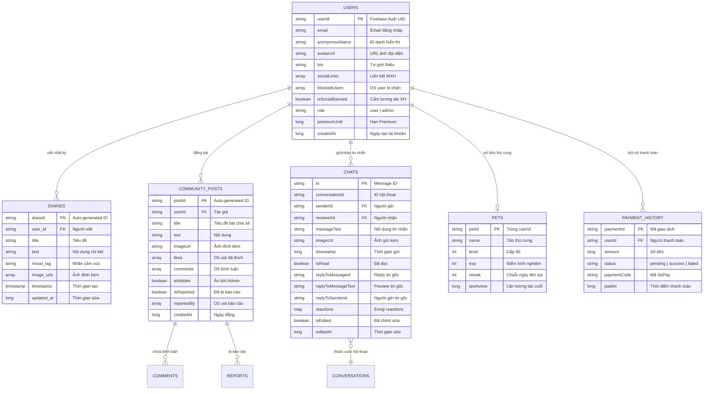
```mermaid
erDiagram
    USERS ||--o{ DIARIES : "viết nhật ký"
    USERS ||--o{ COMMUNITY_POSTS : "đăng bài"
    USERS ||--o{ CHATS : "gửi/nhận tin nhắn"
    USERS ||--o| PETS : "sở hữu thú cưng"
    USERS ||--o{ PAYMENT_HISTORY : "lịch sử thanh toán"
    COMMUNITY_POSTS ||--o{ COMMENTS : "chứa bình luận"
    COMMUNITY_POSTS ||--o{ REPORTS : "bị báo cáo"
    CHATS }o--|| CONVERSATIONS : "thuộc cuộc hội thoại"

    USERS {
        string userId PK "Firebase Auth UID"
        string email "Email đăng nhập"
        string anonymousName "Bí danh hiển thị"
        string avatarUrl "URL ảnh đại diện"
        string bio "Tự giới thiệu"
        array socialLinks "Liên kết MXH"
        array blockedUsers "DS user bị chặn"
        boolean isSocialBanned "Cấm tương tác XH"
        string role "user | admin"
        long premiumUntil "Hạn Premium"
        long createdAt "Ngày tạo tài khoản"
    }

    DIARIES {
        string diaryId PK "Auto-generated ID"
        string user_id FK "Người viết"
        string title "Tiêu đề"
        string text "Nội dung chi tiết"
        string mood_tag "Nhãn cảm xúc"
        array image_urls "Ảnh đính kèm"
        timestamp timestamp "Thời gian tạo"
        long updated_at "Thời gian sửa"
    }

    COMMUNITY_POSTS {
        string postId PK "Auto-generated ID"
        string userId FK "Tác giả"
        string title "Tiêu đề bài chia sẻ"
        string text "Nội dung"
        string imageUrl "Ảnh đính kèm"
        array likes "DS uid đã thích"
        array comments "DS bình luận"
        boolean isHidden "Ẩn bởi Admin"
        boolean isReported "Đã bị báo cáo"
        array reportedBy "DS uid báo cáo"
        long createdAt "Ngày đăng"
    }

    CHATS {
        string id PK "Message ID"
        string conversationId "ID hội thoại"
        string senderId FK "Người gửi"
        string receiverId FK "Người nhận"
        string messageText "Nội dung tin nhắn"
        string imageUrl "Ảnh gửi kèm"
        long timestamp "Thời gian gửi"
        boolean isRead "Đã đọc"
        string replyToMessageId "Reply tin gốc"
        string replyToMessageText "Preview tin gốc"
        string replyToSenderId "Người gửi tin gốc"
        map reactions "Emoji reactions"
        boolean isEdited "Đã chỉnh sửa"
        long editedAt "Thời gian sửa"
    }

    PETS {
        string petId PK "Trùng userId"
        string name "Tên thú cưng"
        int level "Cấp độ"
        int exp "Điểm kinh nghiệm"
        int streak "Chuỗi ngày liên tục"
        long lastActive "Lần tương tác cuối"
    }

    PAYMENT_HISTORY {
        string paymentId PK "Mã giao dịch"
        string userId FK "Người thanh toán"
        long amount "Số tiền"
        string status "pending | success | failed"
        string paymentCode "Mã SePay"
        long paidAt "Thời điểm thanh toán"
    }
```

---

## 1.2. Chi Tiết Từng Collection

### Collection `users` — Hồ sơ Người dùng

| # | Trường | Kiểu | Bắt buộc | Mô tả chi tiết |
|---|--------|------|----------|-----------------|
| 1 | `userId` (Doc ID) | `String` | ✅ | UID duy nhất từ Firebase Authentication, dùng làm khoá chính |
| 2 | `email` | `String` | ✅ | Email đã xác thực qua Firebase Auth |
| 3 | `anonymousName` | `String` | ✅ | Tên hiển thị ẩn danh trên Chat và Community |
| 4 | `avatarUrl` | `String` | ❌ | URL ảnh đại diện lưu trên Cloudinary |
| 5 | `bio` | `String` | ❌ | Phần tự giới thiệu bản thân (tối đa 200 ký tự) |
| 6 | `socialLinks` | `Array<Map>` | ❌ | Mảng các liên kết MXH, mỗi phần tử gồm `{ platform, url }` (tối đa 5) |
| 7 | `blockedUsers` | `Array<String>` | ❌ | Mảng UID những user bị chặn. Dùng `FieldValue.arrayUnion/Remove` để cập nhật |
| 8 | `isSocialBanned` | `Boolean` | ✅ | `true` = User bị Admin cấm mọi hoạt động tương tác cộng đồng |
| 9 | `role` | `String` | ✅ | Phân quyền: `"user"` (mặc định) hoặc `"admin"` |
| 10 | `premiumUntil` | `Long` | ❌ | Unix timestamp hết hạn VIP. `null` = tài khoản thường |
| 11 | `createdAt` | `Long` | ✅ | Unix timestamp thời điểm đăng ký |

### Collection `diaries` — Nhật ký Cảm xúc

| # | Trường | Kiểu | Bắt buộc | Mô tả chi tiết |
|---|--------|------|----------|-----------------|
| 1 | `diaryId` (Doc ID) | `String` | ✅ | ID tự sinh bởi Firestore |
| 2 | `user_id` | `String` | ✅ | UID của người viết (FK → users) |
| 3 | `title` | `String` | ✅ | Tiêu đề nhật ký |
| 4 | `text` | `String` | ✅ | Nội dung văn bản rich-text |
| 5 | `mood_tag` | `String` | ✅ | Nhãn tâm trạng: `Happy`, `Sad`, `Calm`, `Anxious`, `Neutral`, v.v. |
| 6 | `image_urls` | `Array<String>` | ❌ | Danh sách URL ảnh đính kèm (lưu trữ Cloudinary) |
| 7 | `timestamp` | `Timestamp` | ✅ | Firestore Server Timestamp — thời gian tạo bản ghi |
| 8 | `updated_at` | `Long` | ❌ | Unix timestamp lần chỉnh sửa cuối |

### Collection `community_posts` — Bài đăng Cộng đồng

| # | Trường | Kiểu | Bắt buộc | Mô tả chi tiết |
|---|--------|------|----------|-----------------|
| 1 | `postId` (Doc ID) | `String` | ✅ | ID bài đăng tự sinh |
| 2 | `userId` | `String` | ✅ | UID tác giả (FK → users) |
| 3 | `title` | `String` | ✅ | Tiêu đề chia sẻ |
| 4 | `text` | `String` | ✅ | Nội dung chia sẻ |
| 5 | `imageUrl` | `String` | ❌ | URL ảnh bìa đính kèm |
| 6 | `likes` | `Array<String>` | ❌ | Mảng UID đã thích (toggle bằng `arrayUnion/Remove`) |
| 7 | `comments` | `Array<Map>` | ❌ | Bình luận dạng embedded: `[{ id, userId, text, createdAt }]` |
| 8 | `isHidden` | `Boolean` | ✅ | `true` = Bài viết bị Admin ẩn khỏi feed |
| 9 | `isReported` | `Boolean` | ✅ | `true` = Bài viết đang bị báo cáo vi phạm |
| 10 | `reportedBy` | `Array<String>` | ❌ | Mảng UID những người báo cáo |
| 11 | `createdAt` | `Long` | ✅ | Unix timestamp ngày đăng |

### Collection `chats` — Tin nhắn Trò chuyện

| # | Trường | Kiểu | Bắt buộc | Mô tả chi tiết |
|---|--------|------|----------|-----------------|
| 1 | `id` (Doc ID) | `String` | ✅ | ID tin nhắn tự sinh |
| 2 | `conversationId` | `String` | ✅ | Khoá ghép: `min(uidA,uidB)_max(uidA,uidB)` |
| 3 | `senderId` | `String` | ✅ | UID người gửi (FK → users) |
| 4 | `receiverId` | `String` | ✅ | UID người nhận (FK → users) |
| 5 | `messageText` | `String` | ❌ | Nội dung văn bản (có thể null nếu gửi ảnh) |
| 6 | `imageUrl` | `String` | ❌ | URL ảnh gửi kèm |
| 7 | `timestamp` | `Long` | ✅ | Unix timestamp thời điểm gửi |
| 8 | `isRead` | `Boolean` | ✅ | Trạng thái đã đọc |
| 9 | `replyToMessageId` | `String` | ❌ | ID tin nhắn gốc khi trả lời (Reply Context) |
| 10 | `replyToMessageText` | `String` | ❌ | Bản preview nội dung tin nhắn gốc |
| 11 | `replyToSenderId` | `String` | ❌ | UID người gửi tin nhắn gốc |
| 12 | `reactions` | `Map<String, Array>` | ❌ | Bảng emoji reactions: `{ "❤️": ["uid1"], "👍": ["uid2"] }` |
| 13 | `isEdited` | `Boolean` | ❌ | `true` = Tin nhắn đã được chỉnh sửa |
| 14 | `editedAt` | `Long` | ❌ | Thời điểm chỉnh sửa tin nhắn |

### Collection `pets` — Thú cưng Đồng hành

| # | Trường | Kiểu | Bắt buộc | Mô tả chi tiết |
|---|--------|------|----------|-----------------|
| 1 | `petId` (Doc ID) | `String` | ✅ | Trùng với UID chủ sở hữu |
| 2 | `name` | `String` | ✅ | Tên đặt cho thú cưng |
| 3 | `level` | `Integer` | ✅ | Cấp độ hiện tại (bắt đầu từ 1) |
| 4 | `exp` | `Integer` | ✅ | Tổng điểm kinh nghiệm tích luỹ |
| 5 | `streak` | `Integer` | ✅ | Số ngày liên tục viết nhật ký |
| 6 | `lastActive` | `Long` | ✅ | Unix timestamp lần tương tác cuối |

### Collection `payment_history` — Lịch sử Thanh toán

| # | Trường | Kiểu | Bắt buộc | Mô tả chi tiết |
|---|--------|------|----------|-----------------|
| 1 | `paymentId` (Doc ID) | `String` | ✅ | Mã giao dịch nội bộ |
| 2 | `userId` | `String` | ✅ | UID người thanh toán (FK → users) |
| 3 | `amount` | `Long` | ✅ | Số tiền giao dịch (VND) |
| 4 | `status` | `String` | ✅ | Trạng thái: `pending`, `success`, `failed` |
| 5 | `paymentCode` | `String` | ✅ | Mã thanh toán SePay (dùng để đối soát webhook) |
| 6 | `packageName` | `String` | ✅ | Tên gói Premium đã mua |
| 7 | `paidAt` | `Long` | ❌ | Unix timestamp thời điểm xác nhận thành công |

---

# 2. THIẾT KẾ CÁC LỚP VÀ KIẾN TRÚC HỆ THỐNG

## 2.1. Tổng Quan Kiến Trúc Toàn Hệ Thống

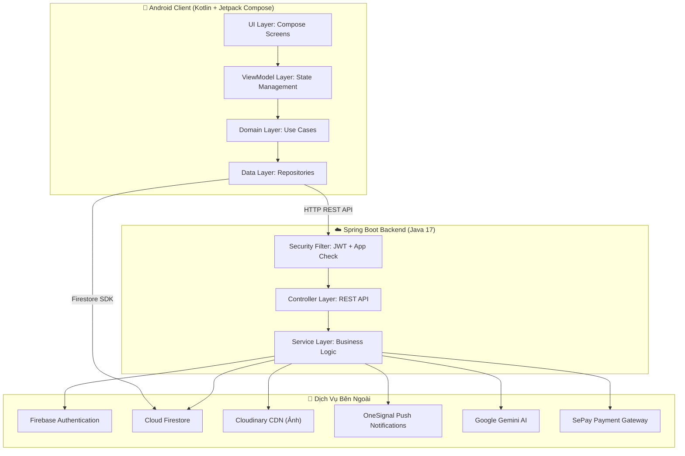
```mermaid
graph TB
    subgraph MobileApp ["📱 Android Client (Kotlin + Jetpack Compose)"]
        UI["UI Layer: Compose Screens"]
        ViewModel["ViewModel Layer: State Management"]
        UseCase["Domain Layer: Use Cases"]
        Repo["Data Layer: Repositories"]
    end

    subgraph Backend ["☁️ Spring Boot Backend (Java 17)"]
        SecurityFilter["Security Filter: JWT + App Check"]
        Controllers["Controller Layer: REST API"]
        Services["Service Layer: Business Logic"]
    end

    subgraph ExternalServices ["🔧 Dịch Vụ Bên Ngoài"]
        FirebaseAuth["Firebase Authentication"]
        Firestore["Cloud Firestore"]
        Cloudinary["Cloudinary CDN (Ảnh)"]
        OneSignal["OneSignal Push Notifications"]
        GeminiAI["Google Gemini AI"]
        SePay["SePay Payment Gateway"]
    end

    UI --> ViewModel
    ViewModel --> UseCase
    UseCase --> Repo
    Repo -->|HTTP REST API| SecurityFilter
    Repo -->|Firestore SDK| Firestore
    SecurityFilter --> Controllers
    Controllers --> Services
    Services --> Firestore
    Services --> FirebaseAuth
    Services --> Cloudinary
    Services --> OneSignal
    Services --> GeminiAI
    Services --> SePay
```

## 2.2. Kiến Trúc Mobile Client — Clean Architecture + MVVM

### Tầng Presentation (UI Layer)

Sử dụng **Jetpack Compose** xây dựng giao diện khai báo (Declarative UI). Gồm 13 module giao diện:

| Module | Mô tả | Màn hình chính |
|--------|-------|----------------|
| `ui/home` | Trang chủ & trình phát nhạc | `HomeScreen`, `MusicPlayerScreen`, `FullPlayerScreen` |
| `ui/journal` | Nhật ký cảm xúc | `JournalScreen`, `DiaryEditorScreen`, `MoodSelectScreen` |
| `ui/chat` | Nhắn tin realtime | `ChatListScreen`, `ChatRoomScreen`, `ChatInfoScreen` |
| `ui/social` | Cộng đồng chia sẻ | `CommunityScreen`, `PostDetailScreen`, `CreatePostScreen` |
| `ui/pet` | Thú cưng đồng hành | `PetScreen`, `PetInteractionView` |
| `ui/stats` | Thống kê tâm trạng | `StatsScreen`, `MoodChartView` |
| `ui/setting` | Cài đặt & hồ sơ | `SettingsScreen`, `ProfileEditScreen`, `LanguageScreen` |
| `ui/admin` | Quản trị hệ thống | `AdminDashboardScreen`, `ReportManagementScreen` |
| `ui/login` | Đăng nhập/đăng ký | `LoginScreen`, `RegisterScreen`, `ForgotPasswordScreen` |
| `ui/recording` | Ghi âm giọng nói | `RecordingScreen` |
| `ui/presence` | Hiển thị trạng thái online | `PresenceIndicator` |
| `ui/components` | Components tái sử dụng | `BottomNavBar`, `ImageViewer`, `LoadingIndicator` |
| `ui/theme` | Chủ đề & Typography | `SoulMateTheme`, `AppColors`, `AppTypography` |

### Tầng Domain (Business Logic Layer)

Chứa **9 Domain Models**, **10 Repository Interfaces**, và **4 Use Cases**:

**Domain Models:**

| Model | File | Mô tả |
|-------|------|-------|
| `User` | `User.kt` | Thực thể người dùng với profile, role, premium status |
| `Diary` | `Diary.kt` | Bản ghi nhật ký gồm tiêu đề, nội dung, mood, ảnh |
| `ChatMessage` | `ChatMessage.kt` | Tin nhắn chat gồm text, ảnh, reactions, reply context |
| `SoulPet` | `SoulPet.kt` | Thú cưng với level, exp, streak |
| `MoodTag` | `MoodTag.kt` | Enum các loại nhãn tâm trạng |
| `MoodStatistic` | `MoodStatistic.kt` | Dữ liệu thống kê tần suất mood |
| `PremiumOffer` | `PremiumOffer.kt` | Gói Premium với giá và thời hạn |
| `PremiumPaymentOrder` | `PremiumPaymentOrder.kt` | Đơn thanh toán Premium |
| `UserPresence` | `UserPresence.kt` | Trạng thái online/offline realtime |

**Repository Interfaces (Contracts):**

| Interface | Mô tả |
|-----------|-------|
| `IAuthRepository` | Đăng nhập, đăng ký, quên mật khẩu, đăng xuất |
| `IDiaryRepository` | CRUD nhật ký, tìm kiếm theo ngày |
| `IChatRepository` | Gửi/nhận tin, reaction, edit, delete, media list |
| `ICommunityRepository` | CRUD bài đăng, like, comment, report |
| `IUserRepository` | Profile CRUD, block/unblock, social links |
| `IPetRepository` | Lấy thông tin pet, cập nhật XP/streak |
| `IPaymentRepository` | Tạo đơn thanh toán, kiểm tra trạng thái |
| `ISettingsRepository` | Ngôn ngữ, theme, thông báo, cache |
| `IAIRepository` | Gọi Gemini API phân tích cảm xúc |
| `IUserPresenceRepository` | Theo dõi trạng thái online/offline |

**Use Cases:**

| Use Case | Mô tả |
|----------|-------|
| `SaveDiaryUseCase` | Lưu nhật ký mới + trigger cập nhật pet XP |
| `AnalyzeMoodUseCase` | Gọi Gemini AI để phân tích mood từ văn bản |
| `GetMoodStatisticsUseCase` | Tổng hợp thống kê mood theo thời gian |
| `CalculatePetXPUseCase` | Tính toán XP và level up cho thú cưng |

### Tầng Data (Data Access Layer)

**Dependency Injection (Hilt Modules):**

| Module | Cung cấp |
|--------|----------|
| `FirebaseModule` | `FirebaseAuth`, `FirebaseFirestore` instances |
| `NetworkModule` | `Retrofit`, `OkHttpClient` với Auth Interceptor |
| `RepositoryModule` | Bind tất cả Repository Implementations → Interfaces |
| `SettingsModule` | `DataStore<Preferences>` cho cài đặt cục bộ |

## 2.3. Kiến Trúc Backend Server — Layered Architecture

### Tầng Security (Bảo mật)

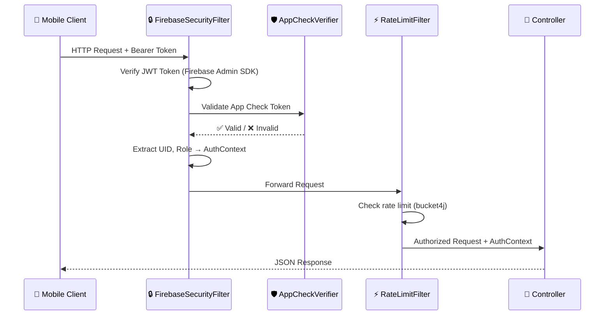
```mermaid
sequenceDiagram
    participant Client as 📱 Mobile Client
    participant Filter as 🔒 FirebaseSecurityFilter
    participant AppCheck as 🛡️ AppCheckVerifier
    participant RateLimit as ⚡ RateLimitFilter
    participant Controller as 🎯 Controller

    Client->>Filter: HTTP Request + Bearer Token
    Filter->>Filter: Verify JWT Token (Firebase Admin SDK)
    Filter->>AppCheck: Validate App Check Token
    AppCheck-->>Filter: ✅ Valid / ❌ Invalid
    Filter->>Filter: Extract UID, Role → AuthContext
    Filter->>RateLimit: Forward Request
    RateLimit->>RateLimit: Check rate limit (bucket4j)
    RateLimit->>Controller: Authorized Request + AuthContext
    Controller-->>Client: JSON Response
```

| Lớp | File | Chức năng |
|-----|------|-----------|
| `AuthContext` | `AuthContext.java` | Record chứa `uid`, `appId`, `role` |
| `AuthContextHolder` | `AuthContextHolder.java` | Thread-safe storage cho AuthContext (Request Attribute) |
| `FirebaseSecurityFilter` | `FirebaseSecurityFilter.java` | Servlet Filter xác thực JWT Bearer token |
| `FirebaseJwtAppCheckVerifier` | `FirebaseJwtAppCheckVerifier.java` | Xác thực Firebase App Check token chống giả mạo |
| `RateLimitFilter` | `RateLimitFilter.java` | Giới hạn tần suất request (Rate Limiting) |

### Tầng Controller (API Endpoints)

| Controller | Prefix | Endpoints Chính |
|------------|--------|-----------------|
| `ChatController` | `/api/secure/chats` | `POST /send`, `GET /conversation/{id}`, `GET /inbox`, `DELETE /conversation/{id}`, `POST /messages/{id}/react`, `PUT /messages/{id}/edit`, `GET /conversation/{id}/media` |
| `CommunityController` | `/api/secure/community` | `GET /posts`, `POST /posts`, `PUT /posts/{id}`, `DELETE /posts/{id}`, `POST /posts/{id}/like`, `POST /posts/{id}/comment`, `POST /posts/{id}/report`, `GET /posts/{id}/author` |
| `DiaryController` | `/api/secure/diaries` | `GET /`, `POST /`, `PUT /{id}`, `DELETE /{id}` |
| `UserController` | `/api/secure/users` | `GET /{id}/profile`, `PUT /profile`, `PUT /profile/avatar`, `POST /block/{id}`, `DELETE /block/{id}`, `GET /blocked` |
| `PrivacyController` | `/api/secure/privacy` | `POST /change-password`, `DELETE /account`, `GET /blocked-users` |
| `AdminController` | `/api/secure/admin` | `POST /users/{id}/toggle-ban`, `GET /reports`, `POST /posts/{id}/hide` |
| `PaymentController` | `/api/secure/payment` | `POST /create-order`, `GET /status/{code}`, `GET /offers` |
| `PublicPaymentController` | `/api/public/payment` | `POST /sepay-webhook` (không cần auth) |
| `AiController` | `/api/secure/ai` | `POST /analyze-mood` |
| `CloudinaryController` | `/api/secure/cloudinary` | `POST /upload-signature` |
| `SecurityController` | `/api/secure/security` | `GET /ping` (health check) |

### Tầng Service (Business Logic)

| Service | Chức năng chính |
|---------|-----------------|
| `ChatService` | Gửi tin nhắn (kèm blocking validation, reply context), reaction toggle, edit tin nhắn, list media, quản lý inbox/conversation |
| `CommunityService` | CRUD bài đăng, like/unlike toggle, thêm/xoá comment, report bài viết, Admin hide post, lấy author profile |
| `DiaryService` | CRUD nhật ký, sắp xếp theo thời gian giảm dần với fallback logic |
| `UserService` | Truy vấn/cập nhật hồ sơ, đổi avatar, block/unblock user, toggle social ban |
| `PrivacyService` | Gửi email reset password (Firebase Admin SDK), xoá tài khoản hàng loạt (Batch Firestore + Firebase Auth) |
| `PaymentService` | Tạo đơn thanh toán, xử lý SePay webhook callback, tự động gia hạn Premium |
| `GeminiService` | Gọi Google Gemini API phân tích cảm xúc từ văn bản nhật ký |
| `CloudinaryService` | Tạo upload signature cho Cloudinary CDN |
| `OneSignalPushNotificationService` | Gửi thông báo đẩy realtime qua OneSignal REST API |

### Tầng Config (Cấu hình)

| File | Chức năng |
|------|-----------|
| `FirebaseAdminConfig` | Khởi tạo Firebase Admin SDK từ `service-account.json`, cung cấp `Firestore` và `FirebaseAuth` beans |
| `BackendProperties` | Đọc cấu hình từ `application.properties`: API keys, OneSignal, Gemini, SePay, Cloudinary |
| `CorsConfig` | Cấu hình CORS cho phép frontend/mobile truy cập API |
| `HttpClientConfig` | Cấu hình `RestTemplate` cho HTTP calls đi (OneSignal, Gemini) |
| `FirebaseProperties` | Cấu hình đường dẫn service account file |

---

# 3. SƠ ĐỒ LỚP (CLASS DIAGRAM)

## 3.1. Class Diagram — Phân Hệ Chat

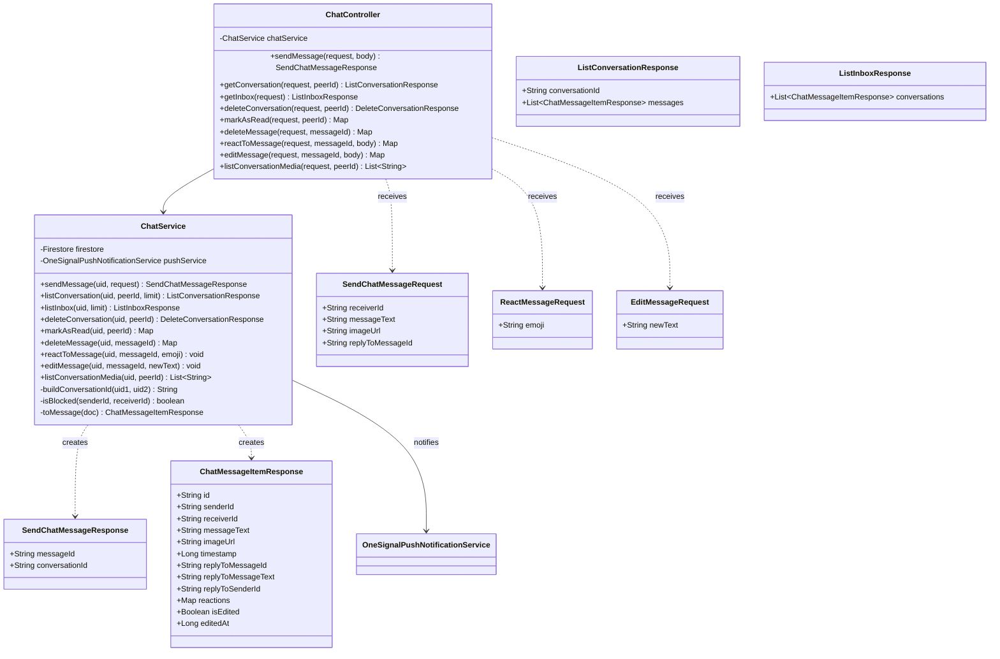
```mermaid
classDiagram
    class ChatController {
        -ChatService chatService
        +sendMessage(request, body) SendChatMessageResponse
        +getConversation(request, peerId) ListConversationResponse
        +getInbox(request) ListInboxResponse
        +deleteConversation(request, peerId) DeleteConversationResponse
        +markAsRead(request, peerId) Map
        +deleteMessage(request, messageId) Map
        +reactToMessage(request, messageId, body) Map
        +editMessage(request, messageId, body) Map
        +listConversationMedia(request, peerId) List~String~
    }

    class ChatService {
        -Firestore firestore
        -OneSignalPushNotificationService pushService
        +sendMessage(uid, request) SendChatMessageResponse
        +listConversation(uid, peerId, limit) ListConversationResponse
        +listInbox(uid, limit) ListInboxResponse
        +deleteConversation(uid, peerId) DeleteConversationResponse
        +markAsRead(uid, peerId) Map
        +deleteMessage(uid, messageId) Map
        +reactToMessage(uid, messageId, emoji) void
        +editMessage(uid, messageId, newText) void
        +listConversationMedia(uid, peerId) List~String~
        -buildConversationId(uid1, uid2) String
        -isBlocked(senderId, receiverId) boolean
        -toMessage(doc) ChatMessageItemResponse
    }

    class SendChatMessageRequest {
        +String receiverId
        +String messageText
        +String imageUrl
        +String replyToMessageId
    }
    class SendChatMessageResponse {
        +String messageId
        +String conversationId
    }
    class ChatMessageItemResponse {
        +String id
        +String senderId
        +String receiverId
        +String messageText
        +String imageUrl
        +Long timestamp
        +String replyToMessageId
        +String replyToMessageText
        +String replyToSenderId
        +Map reactions
        +Boolean isEdited
        +Long editedAt
    }
    class ListConversationResponse {
        +String conversationId
        +List~ChatMessageItemResponse~ messages
    }
    class ListInboxResponse {
        +List~ChatMessageItemResponse~ conversations
    }
    class ReactMessageRequest {
        +String emoji
    }
    class EditMessageRequest {
        +String newText
    }

    ChatController --> ChatService
    ChatService ..> SendChatMessageResponse : creates
    ChatService ..> ChatMessageItemResponse : creates
    ChatController ..> SendChatMessageRequest : receives
    ChatController ..> ReactMessageRequest : receives
    ChatController ..> EditMessageRequest : receives
    ChatService --> OneSignalPushNotificationService : notifies
```

## 3.2. Class Diagram — Phân Hệ User & Privacy

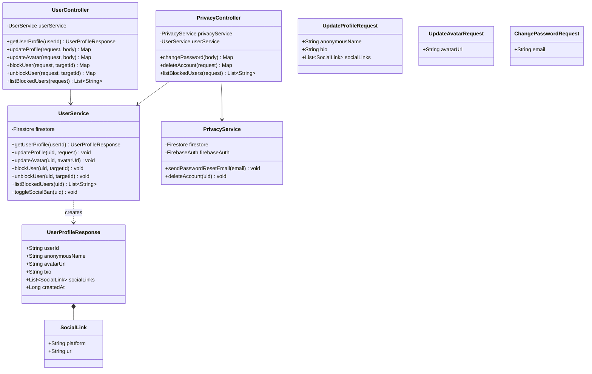
```mermaid
classDiagram
    class UserController {
        -UserService userService
        +getUserProfile(userId) UserProfileResponse
        +updateProfile(request, body) Map
        +updateAvatar(request, body) Map
        +blockUser(request, targetId) Map
        +unblockUser(request, targetId) Map
        +listBlockedUsers(request) List~String~
    }

    class UserService {
        -Firestore firestore
        +getUserProfile(userId) UserProfileResponse
        +updateProfile(uid, request) void
        +updateAvatar(uid, avatarUrl) void
        +blockUser(uid, targetId) void
        +unblockUser(uid, targetId) void
        +listBlockedUsers(uid) List~String~
        +toggleSocialBan(uid) void
    }

    class PrivacyController {
        -PrivacyService privacyService
        -UserService userService
        +changePassword(body) Map
        +deleteAccount(request) Map
        +listBlockedUsers(request) List~String~
    }

    class PrivacyService {
        -Firestore firestore
        -FirebaseAuth firebaseAuth
        +sendPasswordResetEmail(email) void
        +deleteAccount(uid) void
    }

    class UserProfileResponse {
        +String userId
        +String anonymousName
        +String avatarUrl
        +String bio
        +List~SocialLink~ socialLinks
        +Long createdAt
    }
    class SocialLink {
        +String platform
        +String url
    }
    class UpdateProfileRequest {
        +String anonymousName
        +String bio
        +List~SocialLink~ socialLinks
    }
    class UpdateAvatarRequest {
        +String avatarUrl
    }
    class ChangePasswordRequest {
        +String email
    }

    UserController --> UserService
    PrivacyController --> PrivacyService
    PrivacyController --> UserService
    UserService ..> UserProfileResponse : creates
    UserProfileResponse *-- SocialLink
```

## 3.3. Class Diagram — Phân Hệ Community & Admin

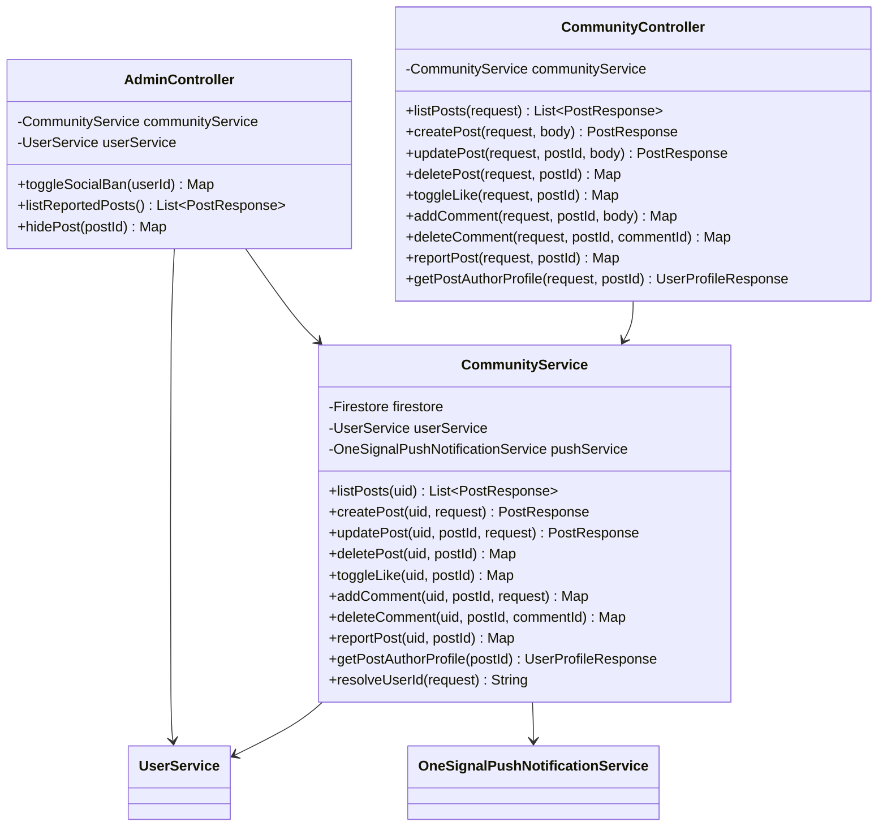
```mermaid
classDiagram
    class CommunityController {
        -CommunityService communityService
        +listPosts(request) List~PostResponse~
        +createPost(request, body) PostResponse
        +updatePost(request, postId, body) PostResponse
        +deletePost(request, postId) Map
        +toggleLike(request, postId) Map
        +addComment(request, postId, body) Map
        +deleteComment(request, postId, commentId) Map
        +reportPost(request, postId) Map
        +getPostAuthorProfile(request, postId) UserProfileResponse
    }

    class CommunityService {
        -Firestore firestore
        -UserService userService
        -OneSignalPushNotificationService pushService
        +listPosts(uid) List~PostResponse~
        +createPost(uid, request) PostResponse
        +updatePost(uid, postId, request) PostResponse
        +deletePost(uid, postId) Map
        +toggleLike(uid, postId) Map
        +addComment(uid, postId, request) Map
        +deleteComment(uid, postId, commentId) Map
        +reportPost(uid, postId) Map
        +getPostAuthorProfile(postId) UserProfileResponse
        +resolveUserId(request) String
    }

    class AdminController {
        -CommunityService communityService
        -UserService userService
        +toggleSocialBan(userId) Map
        +listReportedPosts() List~PostResponse~
        +hidePost(postId) Map
    }

    CommunityController --> CommunityService
    CommunityService --> UserService
    CommunityService --> OneSignalPushNotificationService
    AdminController --> CommunityService
    AdminController --> UserService
```

## 3.4. Class Diagram — Phân Hệ Payment

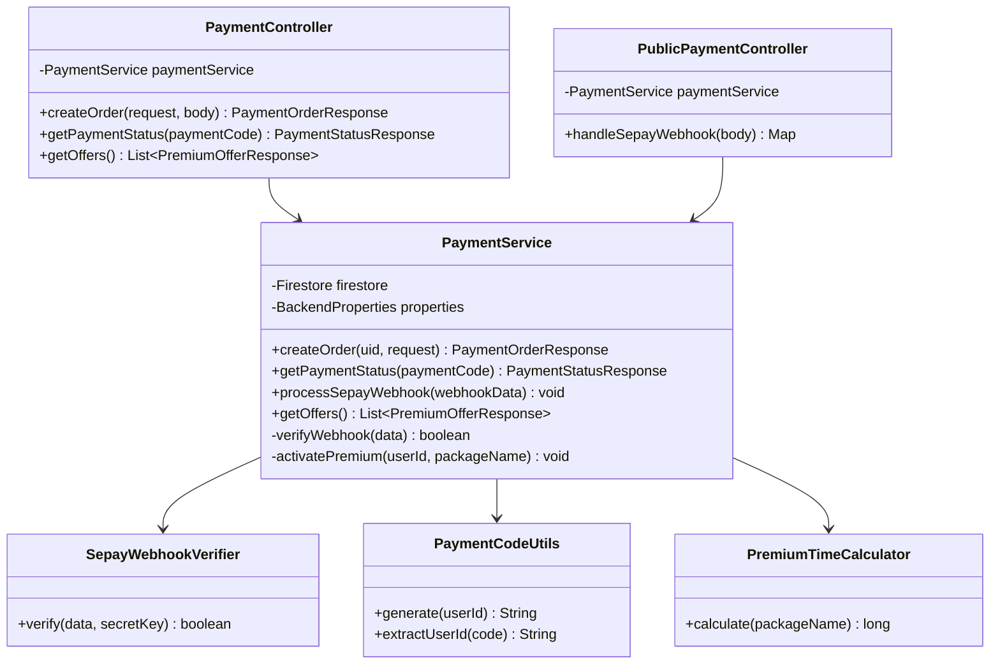
```mermaid
classDiagram
    class PaymentController {
        -PaymentService paymentService
        +createOrder(request, body) PaymentOrderResponse
        +getPaymentStatus(paymentCode) PaymentStatusResponse
        +getOffers() List~PremiumOfferResponse~
    }

    class PublicPaymentController {
        -PaymentService paymentService
        +handleSepayWebhook(body) Map
    }

    class PaymentService {
        -Firestore firestore
        -BackendProperties properties
        +createOrder(uid, request) PaymentOrderResponse
        +getPaymentStatus(paymentCode) PaymentStatusResponse
        +processSepayWebhook(webhookData) void
        +getOffers() List~PremiumOfferResponse~
        -verifyWebhook(data) boolean
        -activatePremium(userId, packageName) void
    }

    class SepayWebhookVerifier {
        +verify(data, secretKey) boolean
    }
    class PaymentCodeUtils {
        +generate(userId) String
        +extractUserId(code) String
    }
    class PremiumTimeCalculator {
        +calculate(packageName) long
    }

    PaymentController --> PaymentService
    PublicPaymentController --> PaymentService
    PaymentService --> SepayWebhookVerifier
    PaymentService --> PaymentCodeUtils
    PaymentService --> PremiumTimeCalculator
```

## 3.5. Class Diagram — Phân Hệ Diary & AI

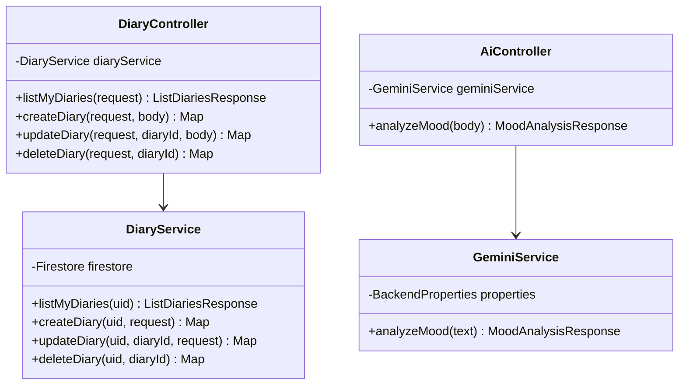
```mermaid
classDiagram
    class DiaryController {
        -DiaryService diaryService
        +listMyDiaries(request) ListDiariesResponse
        +createDiary(request, body) Map
        +updateDiary(request, diaryId, body) Map
        +deleteDiary(request, diaryId) Map
    }

    class DiaryService {
        -Firestore firestore
        +listMyDiaries(uid) ListDiariesResponse
        +createDiary(uid, request) Map
        +updateDiary(uid, diaryId, request) Map
        +deleteDiary(uid, diaryId) Map
    }

    class AiController {
        -GeminiService geminiService
        +analyzeMood(body) MoodAnalysisResponse
    }

    class GeminiService {
        -BackendProperties properties
        +analyzeMood(text) MoodAnalysisResponse
    }

    DiaryController --> DiaryService
    AiController --> GeminiService
```

## 3.6. Class Diagram — Tầng Security & Config

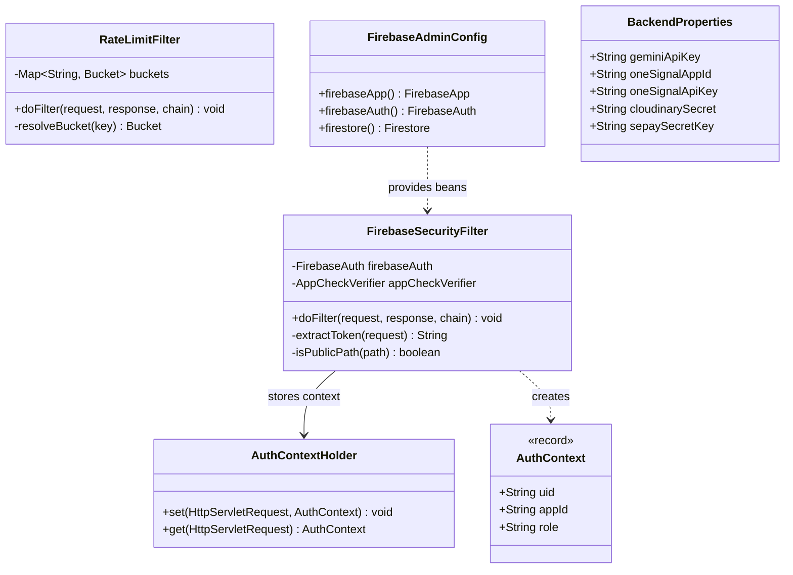
```mermaid
classDiagram
    class FirebaseSecurityFilter {
        -FirebaseAuth firebaseAuth
        -AppCheckVerifier appCheckVerifier
        +doFilter(request, response, chain) void
        -extractToken(request) String
        -isPublicPath(path) boolean
    }

    class AuthContext {
        <<record>>
        +String uid
        +String appId
        +String role
    }

    class AuthContextHolder {
        +set(HttpServletRequest, AuthContext) void
        +get(HttpServletRequest) AuthContext
    }

    class RateLimitFilter {
        -Map~String, Bucket~ buckets
        +doFilter(request, response, chain) void
        -resolveBucket(key) Bucket
    }

    class FirebaseAdminConfig {
        +firebaseApp() FirebaseApp
        +firebaseAuth() FirebaseAuth
        +firestore() Firestore
    }

    class BackendProperties {
        +String geminiApiKey
        +String oneSignalAppId
        +String oneSignalApiKey
        +String cloudinarySecret
        +String sepaySecretKey
    }

    FirebaseSecurityFilter --> AuthContextHolder : stores context
    FirebaseSecurityFilter ..> AuthContext : creates
    FirebaseAdminConfig ..> FirebaseSecurityFilter : provides beans
```

---

# 4. SƠ ĐỒ LUỒNG CHUYỂN MÀN HÌNH (SCREEN FLOW DIAGRAM)

## 4.1. Luồng Tổng Quan Toàn Ứng Dụng

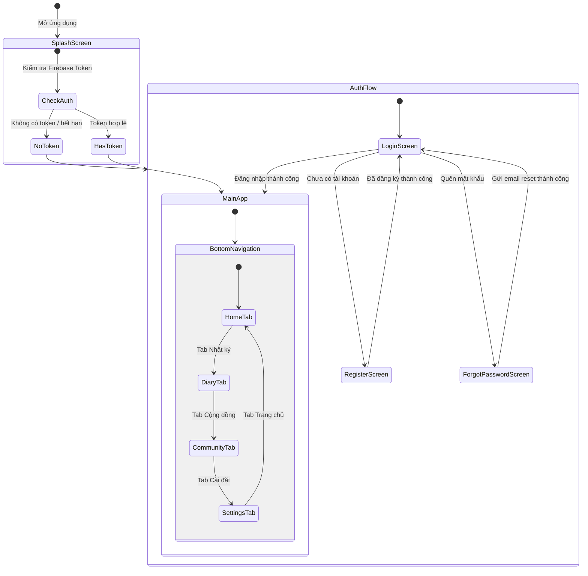
```mermaid
stateDiagram-v2
    [*] --> SplashScreen : Mở ứng dụng

    state SplashScreen {
        [*] --> CheckAuth : Kiểm tra Firebase Token
        CheckAuth --> HasToken : Token hợp lệ
        CheckAuth --> NoToken : Không có token / hết hạn
    }

    NoToken --> AuthFlow
    HasToken --> MainApp

    state AuthFlow {
        [*] --> LoginScreen
        LoginScreen --> RegisterScreen : Chưa có tài khoản
        RegisterScreen --> LoginScreen : Đã đăng ký thành công
        LoginScreen --> ForgotPasswordScreen : Quên mật khẩu
        ForgotPasswordScreen --> LoginScreen : Gửi email reset thành công
        LoginScreen --> MainApp : Đăng nhập thành công
    }

    state MainApp {
        [*] --> BottomNavigation

        state BottomNavigation {
            [*] --> HomeTab
            HomeTab --> DiaryTab : Tab Nhật ký
            DiaryTab --> CommunityTab : Tab Cộng đồng
            CommunityTab --> SettingsTab : Tab Cài đặt
            SettingsTab --> HomeTab : Tab Trang chủ
        }
    }
```

## 4.2. Luồng Chi Tiết — Tab Trang Chủ (Home)

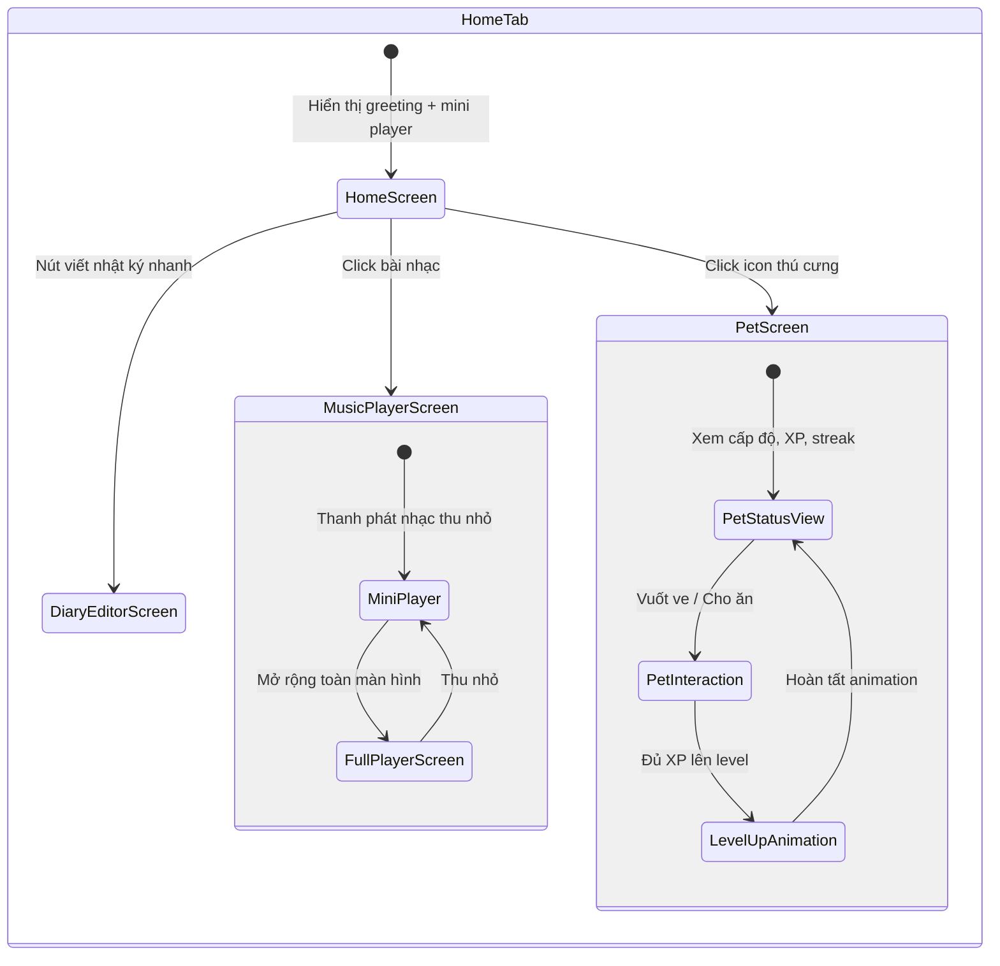
```mermaid
stateDiagram-v2
    state HomeTab {
        [*] --> HomeScreen : Hiển thị greeting + mini player

        HomeScreen --> MusicPlayerScreen : Click bài nhạc
        state MusicPlayerScreen {
            [*] --> MiniPlayer : Thanh phát nhạc thu nhỏ
            MiniPlayer --> FullPlayerScreen : Mở rộng toàn màn hình
            FullPlayerScreen --> MiniPlayer : Thu nhỏ
        }

        HomeScreen --> PetScreen : Click icon thú cưng
        state PetScreen {
            [*] --> PetStatusView : Xem cấp độ, XP, streak
            PetStatusView --> PetInteraction : Vuốt ve / Cho ăn
            PetInteraction --> LevelUpAnimation : Đủ XP lên level
            LevelUpAnimation --> PetStatusView : Hoàn tất animation
        }

        HomeScreen --> DiaryEditorScreen : Nút viết nhật ký nhanh
    }
```

## 4.3. Luồng Chi Tiết — Tab Nhật Ký (Diary/Journal)

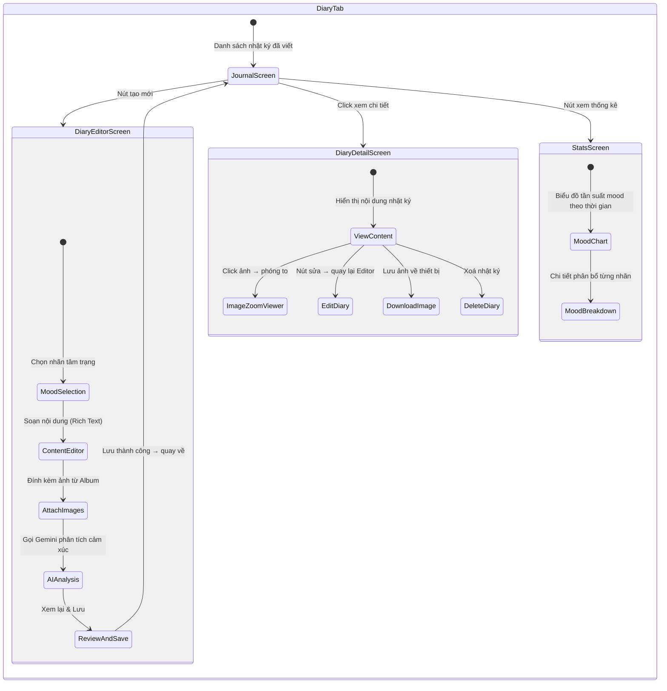
```mermaid
stateDiagram-v2
    state DiaryTab {
        [*] --> JournalScreen : Danh sách nhật ký đã viết

        JournalScreen --> DiaryEditorScreen : Nút tạo mới
        state DiaryEditorScreen {
            [*] --> MoodSelection : Chọn nhãn tâm trạng
            MoodSelection --> ContentEditor : Soạn nội dung (Rich Text)
            ContentEditor --> AttachImages : Đính kèm ảnh từ Album
            AttachImages --> AIAnalysis : Gọi Gemini phân tích cảm xúc
            AIAnalysis --> ReviewAndSave : Xem lại & Lưu
            ReviewAndSave --> JournalScreen : Lưu thành công → quay về
        }

        JournalScreen --> DiaryDetailScreen : Click xem chi tiết
        state DiaryDetailScreen {
            [*] --> ViewContent : Hiển thị nội dung nhật ký
            ViewContent --> ImageZoomViewer : Click ảnh → phóng to
            ViewContent --> EditDiary : Nút sửa → quay lại Editor
            ViewContent --> DownloadImage : Lưu ảnh về thiết bị
            ViewContent --> DeleteDiary : Xoá nhật ký
        }

        JournalScreen --> StatsScreen : Nút xem thống kê
        state StatsScreen {
            [*] --> MoodChart : Biểu đồ tần suất mood theo thời gian
            MoodChart --> MoodBreakdown : Chi tiết phân bổ từng nhãn
        }
    }
```

## 4.4. Luồng Chi Tiết — Tab Cộng Đồng (Community)

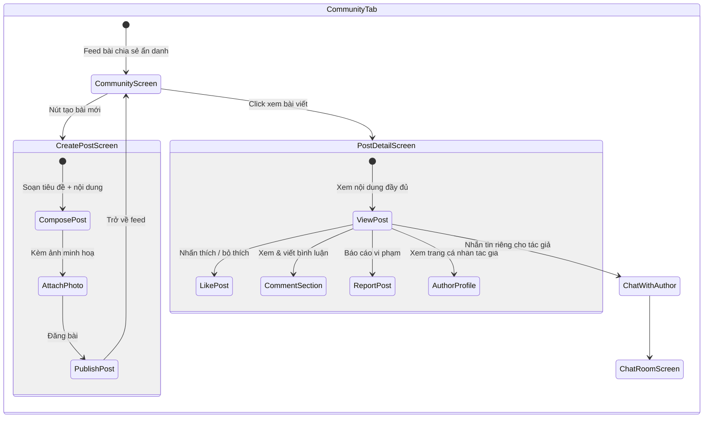
```mermaid
stateDiagram-v2
    state CommunityTab {
        [*] --> CommunityScreen : Feed bài chia sẻ ẩn danh

        CommunityScreen --> CreatePostScreen : Nút tạo bài mới
        state CreatePostScreen {
            [*] --> ComposePost : Soạn tiêu đề + nội dung
            ComposePost --> AttachPhoto : Kèm ảnh minh hoạ
            AttachPhoto --> PublishPost : Đăng bài
            PublishPost --> CommunityScreen : Trở về feed
        }

        CommunityScreen --> PostDetailScreen : Click xem bài viết
        state PostDetailScreen {
            [*] --> ViewPost : Xem nội dung đầy đủ
            ViewPost --> LikePost : Nhấn thích / bỏ thích
            ViewPost --> CommentSection : Xem & viết bình luận
            ViewPost --> ReportPost : Báo cáo vi phạm
            ViewPost --> AuthorProfile : Xem trang cá nhân tác giả
            ViewPost --> ChatWithAuthor : Nhắn tin riêng cho tác giả
        }

        ChatWithAuthor --> ChatRoomScreen
    }
```

## 4.5. Luồng Chi Tiết — Trò Chuyện (Chat)

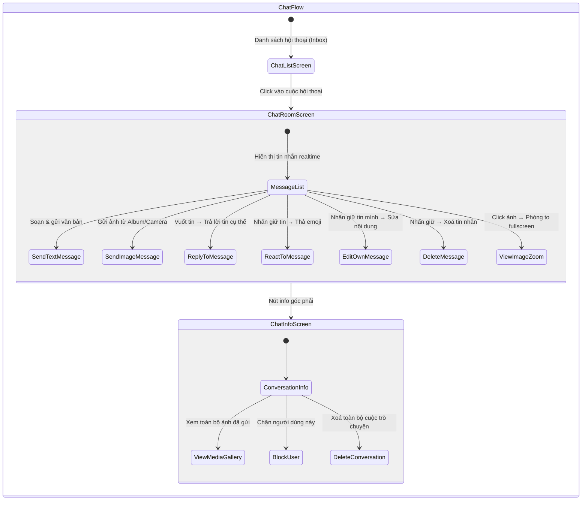
```mermaid
stateDiagram-v2
    state ChatFlow {
        [*] --> ChatListScreen : Danh sách hội thoại (Inbox)

        ChatListScreen --> ChatRoomScreen : Click vào cuộc hội thoại
        state ChatRoomScreen {
            [*] --> MessageList : Hiển thị tin nhắn realtime

            MessageList --> SendTextMessage : Soạn & gửi văn bản
            MessageList --> SendImageMessage : Gửi ảnh từ Album/Camera
            MessageList --> ReplyToMessage : Vuốt tin → Trả lời tin cụ thể
            MessageList --> ReactToMessage : Nhấn giữ tin → Thả emoji
            MessageList --> EditOwnMessage : Nhấn giữ tin mình → Sửa nội dung
            MessageList --> DeleteMessage : Nhấn giữ → Xoá tin nhắn
            MessageList --> ViewImageZoom : Click ảnh → Phóng to fullscreen
        }

        ChatRoomScreen --> ChatInfoScreen : Nút info góc phải
        state ChatInfoScreen {
            [*] --> ConversationInfo
            ConversationInfo --> ViewMediaGallery : Xem toàn bộ ảnh đã gửi
            ConversationInfo --> BlockUser : Chặn người dùng này
            ConversationInfo --> DeleteConversation : Xoá toàn bộ cuộc trò chuyện
        }
    }
```

## 4.6. Luồng Chi Tiết — Tab Cài Đặt (Settings)

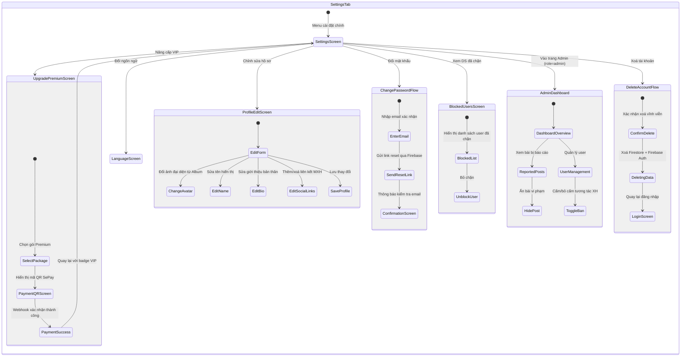
```mermaid
stateDiagram-v2
    state SettingsTab {
        [*] --> SettingsScreen : Menu cài đặt chính

        SettingsScreen --> ProfileEditScreen : Chỉnh sửa hồ sơ
        state ProfileEditScreen {
            [*] --> EditForm
            EditForm --> ChangeAvatar : Đổi ảnh đại diện từ Album
            EditForm --> EditName : Sửa tên hiển thị
            EditForm --> EditBio : Sửa giới thiệu bản thân
            EditForm --> EditSocialLinks : Thêm/xoá liên kết MXH
            EditForm --> SaveProfile : Lưu thay đổi
        }

        SettingsScreen --> ChangePasswordFlow : Đổi mật khẩu
        state ChangePasswordFlow {
            [*] --> EnterEmail : Nhập email xác nhận
            EnterEmail --> SendResetLink : Gửi link reset qua Firebase
            SendResetLink --> ConfirmationScreen : Thông báo kiểm tra email
        }

        SettingsScreen --> BlockedUsersScreen : Xem DS đã chặn
        state BlockedUsersScreen {
            [*] --> BlockedList : Hiển thị danh sách user đã chặn
            BlockedList --> UnblockUser : Bỏ chặn
        }

        SettingsScreen --> UpgradePremiumScreen : Nâng cấp VIP
        state UpgradePremiumScreen {
            [*] --> SelectPackage : Chọn gói Premium
            SelectPackage --> PaymentQRScreen : Hiển thị mã QR SePay
            PaymentQRScreen --> PaymentSuccess : Webhook xác nhận thành công
            PaymentSuccess --> SettingsScreen : Quay lại với badge VIP
        }

        SettingsScreen --> LanguageScreen : Đổi ngôn ngữ
        SettingsScreen --> AdminDashboard : Vào trang Admin (role=admin)
        state AdminDashboard {
            [*] --> DashboardOverview
            DashboardOverview --> ReportedPosts : Xem bài bị báo cáo
            ReportedPosts --> HidePost : Ẩn bài vi phạm
            DashboardOverview --> UserManagement : Quản lý user
            UserManagement --> ToggleBan : Cấm/bỏ cấm tương tác XH
        }

        SettingsScreen --> DeleteAccountFlow : Xoá tài khoản
        state DeleteAccountFlow {
            [*] --> ConfirmDelete : Xác nhận xoá vĩnh viễn
            ConfirmDelete --> DeletingData : Xoá Firestore + Firebase Auth
            DeletingData --> LoginScreen : Quay lại đăng nhập
        }
    }
```

---

### Kết Luận

Báo cáo này trình bày tường cận toàn bộ kiến trúc kỹ thuật của hệ thống SoulMate:

1. **Cơ sở dữ liệu**: 6 Collections Firestore NoSQL với quan hệ tham chiếu rõ ràng, tối ưu cho truy vấn realtime.
2. **Kiến trúc hệ thống**: Clean Architecture (MVVM) phía Mobile kết hợp Layered Architecture phía Backend, đảm bảo tách biệt trách nhiệm và dễ bảo trì.
3. **Sơ đồ lớp**: 11 Controllers, 9 Services chính, 36 DTOs, 7 lớp Security, 5 lớp Config — thể hiện đầy đủ qua 6 class diagrams UML chi tiết.
4. **Luồng màn hình**: 13 module UI với sơ đồ trạng thái chi tiết cho từng tab và luồng tương tác phụ (Chat, Diary, Community, Settings, Admin).
